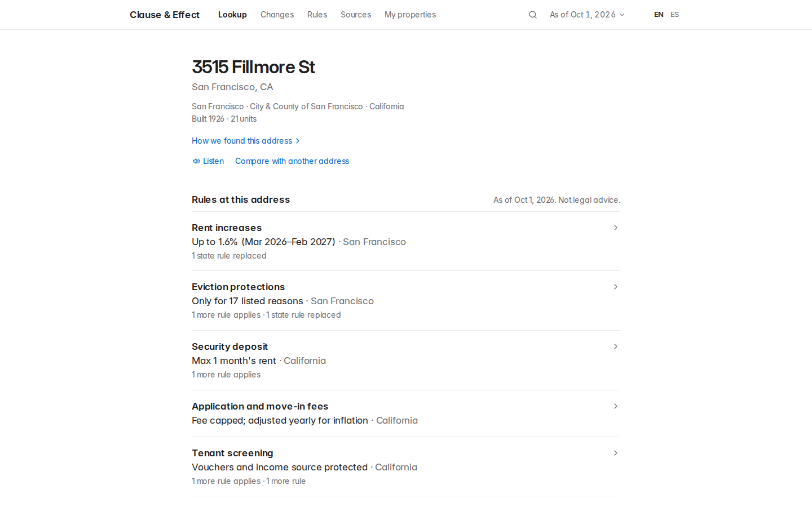
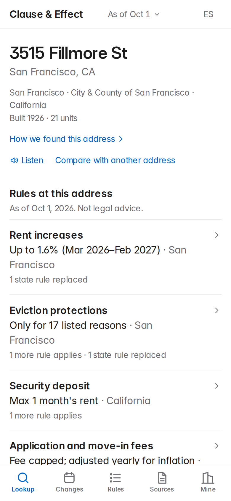
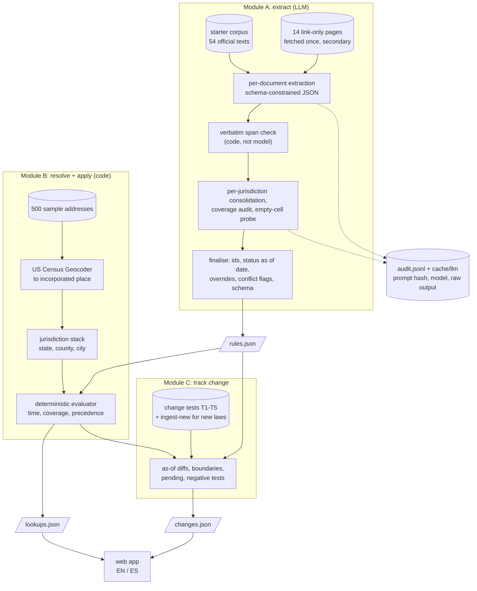
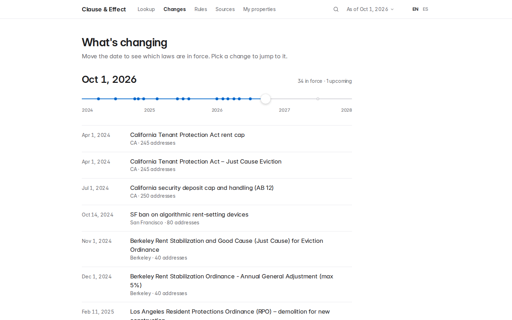
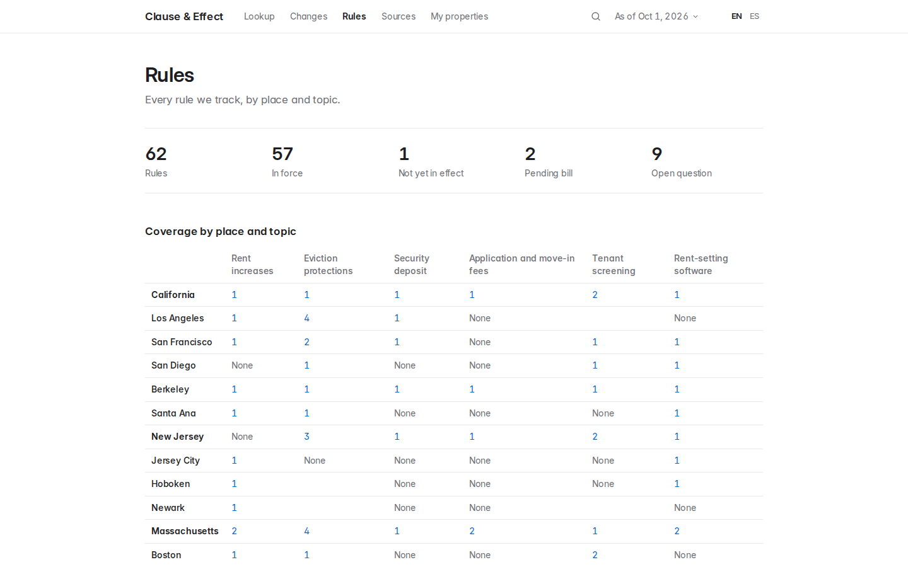
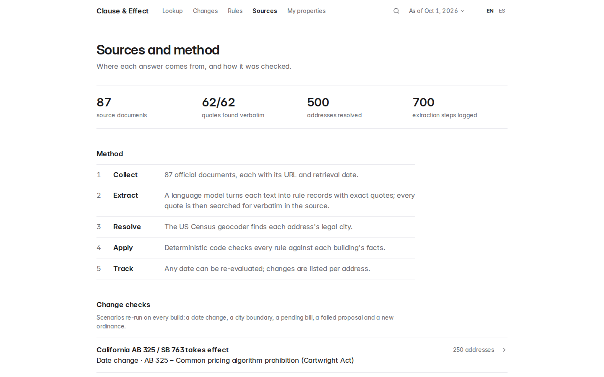

# Clause & Effect: Rental Housing Law Navigator

**Which housing rules apply to this apartment today, and what is about to change?** Type in an address and get every
rule that applies there, each with a citation and a verbatim quote from the law.

[](https://github.com/isaaclins/rental-law-navigator/actions/workflows/ci.yml)
[](LICENSE)
[](https://navigator.isaaclins.com/)

**Live demo: <https://navigator.isaaclins.com/>** · [Method note](docs/METHOD_NOTE.md) ([PDF](docs/METHOD_NOTE.pdf)) ·
[Architecture](docs/ARCHITECTURE.md) ·
[Project board](https://github.com/users/isaaclins/projects/6)

[](https://navigator.isaaclins.com/#/a/A0016)

An LLM reads the public housing law of 3 states and 10 cities (87 source documents) and turns it into structured rule
records. Every quoted span is checked against the source text by code. Each of 500 sample addresses is then resolved
to its *legal* city with the US Census Geocoder. A deterministic evaluator decides which rules apply on any date you
pick. Built in 24 hours for the RealPage challenge at the
[Hack-Nation 7th Global AI Hackathon](https://hack-nation.ai/) (October 3-4, 2026).

> [!IMPORTANT]
> **Not legal advice.** This is a research prototype. It summarises public law from a fixed corpus (as of
> 2026-10-01) and is not a compliance check. Every answer links to the source; read it before you rely on it.

## Features



- **Address lookup** with a plain one-line answer per topic; the rules, quotes and sources are one tap away.
- **As-of date** on every answer: pick any date and every page is re-evaluated for it.
- **What's changing:** a timeline of laws taking effect, with the addresses each one affects.
- **Rules explorer:** every rule by place and topic, with coverage, status and conflict flags.
- **Sources and method:** the audit log, the source texts and how each address was geocoded.
- **English and Spanish.** Citations and quoted law stay in the original English.
- **Any US address:** the live Census geocoder finds the legal city; you add the building facts (year built, units)
  that the answer depends on.
- **Check a rent increase** (#40): deterministic verdicts for a rent increase, deposit, fee or notice, each with the
  deciding quote.
- **Compare two addresses** side by side (#48).
- **Listen** (#49): the answer read aloud with an ElevenLabs voice, budgeted and cached, with a browser-voice fallback.
- **My properties:** Google sign-in, saved buildings, an ICS calendar feed and email alerts before a law change
  (daily digest, one-click unsubscribe).
- **Installable app (PWA)** that keeps recent answers readable offline.

<br clear="right">

## Contents

[Features](#features) · [What it answers](#what-it-answers) · [Results](#results) · [How it works](#how-it-works) ·
[Quickstart](#quickstart) · [Output files](#output-files) · [Responsible design](#responsible-design) ·
[Scalability path](#scalability-path) · [Repository layout](#repository-layout) ·
[How it was built](#how-it-was-built) · [Limitations](#limitations) · [License](#license)

## What it answers

This is the brief's own example: a pre-1979 apartment building in San Francisco. Output of
`uv run python -m navigator lookup A0016` (21 units, built 1926), as of **2026-10-01**:

**Jurisdiction stack:** California › City & County of San Francisco (Census batch geocoder, exact match).

| Topic | Result | What it means | Citation |
|---|---|---|---|
| Rent increases | **applies** | SF Rent Ordinance: 1.6% for 3/1/2026-2/28/2027. Built 1926, so it meets the "certificate of occupancy on or before 1979-06-13" cutoff. | S.F. Admin. Code ch. 37 |
| | superseded | The state cap (5% + CPI, max 10%) yields to the local ordinance. | Cal. Civ. Code § 1947.12 |
| Eviction | **applies** | Eviction only for the 17 listed just causes. Relocation: $8,245 per tenant, max $24,733 per unit. The state just-cause law is superseded. | S.F. Admin. Code §§ 37.9(a), 37.9C |
| Security deposit | **applies** | Max 1 month's rent (2 for qualifying small landlords), plus SF's 4.2% deposit interest. | Cal. Civ. Code § 1950.5 · S.F. Admin. Code ch. 37 |
| Application fee | **applies** ⚑ | $30 base, CPI-adjusted. **Flagged for review:** the statute gives no single official 2026 dollar figure. | Cal. Civ. Code § 1950.6 |
| Tenant screening | **applies** / unknown | Source of income is protected, and blanket criminal-history bans are not allowed. The SF Fair Chance Ordinance is **unknown**: it only covers affordable housing, and the data cannot show that. | Cal. Gov. Code § 12955 · FEHA regs |
| Algorithmic pricing | **applies** | Local ban on algorithmic devices that use nonpublic competitor data (up to $1,000 per violation), plus the state ban in force since 2026-01-01. | S.F. Admin. Code § 37.10C · Cal. Bus. & Prof. Code § 16729 |

It also records a *no-rule finding*: the documents show no San Francisco application-fee ordinance, so the state cap governs.
Change the date and the answer changes too. As of 2025-12-31, the state algorithmic-pricing ban shows as
`not_yet_effective`.

Each answer in the API and the web app carries the rule's `quoted_span`, `source_url`, `retrieved_at`, `confidence`
and `conflict_note`.

## Results

### Independent QA key

The official scorer and held-out key are not public. As a regression test we wrote our own answer key: 59 rules,
19 no-rule findings and 61 sampled addresses, each with a verbatim quote, built from the corpus separately from the
pipeline ([`qa/`](qa/)). It is **our** key, not the official one, and it cannot catch blind spots that the key and the
pipeline share. 4455 of 4545 "applies" answers quote the starter corpus verbatim; the other 90 quote fetched secondary
pages ([Limitations](#limitations)).

### Change tests

| Test | What a correct system does | Our result |
|---|---|---|
| **T1** CA AB 325 / SB 763 | `not_yet_effective` on 2025-12-31, `applies` on 2026-01-02, every CA address | 250/250 CA addresses flip from `not_yet_effective` to `applies` |
| **T2** Hoboken and Jersey City bans | Each ban only inside its own city; neither in Newark | 40 Hoboken + 50 Jersey City addresses; 0 in Newark |
| **T3** NJ FAIR Act (eff. 2027-07-01) | `not_yet_effective` today, `applies` on 2027-07-02; flags a conflict with the local bans | 140/140 NJ addresses flip; 90/90 Jersey City and Hoboken addresses carry a preemption flag |
| **T4** MA S.2983 / H.5222 | Pending, never in force; list the addresses they would affect | Both bills `pending`; 110/110 Boston and Cambridge addresses |
| **T5** MA ballot question struck | No rent cap for Boston or Cambridge; affected set empty | Initiative Petition 25-21 recorded as `failed`; affected set empty |

`uv run python -m navigator selfcheck` re-checks all of this in CI on every pull request ([`output/selfcheck.txt`](output/selfcheck.txt)):
schema, verbatim spans, the jurisdiction × category coverage matrix, all 25 examples from the brief, T1-T5 and the four
known open questions.

## How it works



1. **Extract (LLM).** The model reads each document and returns rule records in the starter schema, plus a
   machine-readable `coverage` object (unit thresholds, construction cutoffs, new-construction exemptions, facts the
   data cannot show, whether a state rule yields to local law). The prompts name no specific law. Every rule comes from
   the text.
2. **Verify (code).** Each `quoted_span` must occur in its document; the check ignores whitespace and quote style. A span
   that fails goes back to the model once. If it fails again, it snaps to the closest exact passage or the record is
   dropped. Then a per-jurisdiction pass (13 calls) merges duplicates, re-reads documents for empty categories, and
   writes *no-rule findings*.
3. **Resolve (Census).** The mailing city is not the legal city: Dorchester is Boston, and a "Los Angeles" address can
   sit in West Hollywood. The US Census Geocoder places each address in an *incorporated place* (486 batch matches,
   7 single-line, 7 OpenStreetMap fallbacks). 38 of the 500 addresses have a mailing city that differs from their
   legal city.
4. **Apply (code, not the model).** For each rule in the address's jurisdiction stack, the evaluator applies four tests:
   - **time:** `pending`, `not_yet_effective`, failed, sunset;
   - **coverage:** year built, unit count, use code;
   - **precedence:** a state rule yields to a stricter local rule and becomes `superseded`;
   - **conflicts:** possible preemption and open questions raise flags.

   If a coverage fact is missing, the answer is `unknown`. 500 addresses evaluate in 0.3 s for any date.
5. **Track change.** The change tests compare results between two dates, list affected addresses and conflict flags.
   `ingest-new` runs a new ordinance through the same extraction and then re-evaluates every address.

More depth (stages, coverage object, precedence rules, caching, web API): [`docs/ARCHITECTURE.md`](docs/ARCHITECTURE.md).

## Quickstart

You need [uv](https://docs.astral.sh/uv/). Python 3.12+ is installed by uv if missing. No API key is needed to
reproduce the outputs.

```bash
git clone https://github.com/isaaclins/rental-law-navigator && cd rental-law-navigator
uv sync

# Reproduce rules.json, lookups.json, changes.json offline from recorded model responses (~5 s)
uv run python -m navigator run-all          # extract (cached) + evaluate + changes + selfcheck -> "SELFCHECK: OK"
python3 qa/score.py                          # regression test against the independent QA key

# Ask questions
uv run python -m navigator lookup A0016                      # one address, as of 2026-10-01
uv run python -m navigator lookup A0016 --as-of 2027-07-02   # same address, any date
uv run python -m navigator evaluate --as-of 2027-07-02 --out /tmp/lookups_2027.json

# Run the web app -> http://127.0.0.1:8765
uv run uvicorn web.app:app --port 8765
```

The offline rerun rebuilds `lookups.json` and `changes.json` byte for byte. `rules.json` differs only in its
`generated_at` timestamp, and `audit.jsonl` gets one more run appended. This works because every model response is
stored in [`cache/llm/`](cache/llm/), keyed by `sha256(system prompt + prompt + schema)`. The geocoder responses are
stored the same way in [`cache/geo/`](cache/geo/), so `python3 geo/resolve.py` also reruns offline.

**Rerun extraction live with a model.** Any prompt or document change misses the cache and calls the model. To redo
everything from scratch:

```bash
mv cache/llm cache/llm.recorded                      # force cache misses
uv run python -m navigator run-all                   # default backend: Claude Code CLI (`claude -p --model sonnet`)
NAVIGATOR_LLM=api ANTHROPIC_API_KEY=... uv run python -m navigator run-all   # or the Anthropic API directly
NAVIGATOR_LLM=codex uv run python -m navigator run-all                       # or `codex exec` as a fallback
```

At most 3 calls run in parallel (`NAVIGATOR_MAX_PARALLEL`), each under `nice -n 19`. A cold run is about 106 model
calls (see [Scalability path](#scalability-path)).

**Ingest a new law** (any new ordinance or bill, extracted unaided):

```bash
uv run python -m navigator ingest-new path/to/ordinance.txt --jurisdiction "Cambridge, MA" --url https://...
```

This copies the text into `new_docs/`, extracts and consolidates it against the existing rules (2 model calls), writes
the new rules to `rules.json`, re-evaluates all 500 addresses and adds a `new_law` change test (`--test-id` sets its id) to `changes.json`. That test holds the
affected addresses and the before/after results around the extracted effective date.

**Checks** (the same ones CI runs, see [CONTRIBUTING.md](CONTRIBUTING.md)):

```bash
uv run python -m navigator selfcheck                                         # -> output/selfcheck.txt
uv run --no-project --with jsonschema python scripts/validate_outputs.py     # schema, spans, ids, coverage
uvx ruff check . && uvx ruff format --check .
```

## Output files

All files are in [`output/`](output/) and committed, so CI validates exactly what the demo shows.

| File | What it holds |
|---|---|
| [`rules.json`](output/rules.json) | **Submission.** `rules`: 62 schema-valid records (57 in force, 1 not yet effective, 2 pending, 2 failed), each with citation, source URL, retrieval date, verbatim `quoted_span`, confidence, conflict flag and the `coverage` object. `no_rule_findings`: 29 cited findings that no rule exists at a level. |
| [`lookups.json`](output/lookups.json) | **Submission.** For all 500 addresses, every non-omitted rule with `applies`, `unknown`, `superseded`, `not_yet_effective` or `pending`, plus a plain-language explanation, citation and conflict flag. |
| [`changes.json`](output/changes.json) | **Submission.** For each test: `affected_address_ids`, `conflict_flag_address_ids`, `per_address` before/after results, and the mapping from the test's rule ids to ours. |
| [`audit.jsonl`](output/audit.jsonl) | One line per model call and pipeline step: timestamp, prompt version, prompt hash, model, cache hit, raw model output, dropped or restored candidates, schema errors. |
| [`rules_raw.json`](output/rules_raw.json), [`rules_reviewed.json`](output/rules_reviewed.json) | The candidates before and after consolidation, so you can see what the review step merged or dropped. |
| [`selfcheck.txt`](output/selfcheck.txt) | Human-readable selfcheck report. |

**Why `no_rule_findings` is a separate list.** The brief tests whether systems avoid reporting rules that don't exist,
for example rent control in Massachusetts cities. The schema has no "no rule" status. A finding stored as a rule record
would read as `in_force` and claim a rule exists exactly where there is none. So findings carry `status: "no_rule"`, a
citation and a verbatim quote (for example *G.L. c. 40P, § 4 bars local rent control, so Cambridge has none*). They live
next to the rules, never among them, and are never evaluated against addresses.

## Responsible design

| The brief asks | What the system does | Where to check |
|---|---|---|
| Say "unknown" instead of guessing | Coverage runs as code against parcel facts. When a needed fact is missing (no year built, no unit count, "only affordable housing"), the answer is `unknown`: 626 answers in total, never silently dropped. When the choice is between omitting a rule and `unknown`, the evaluator picks `unknown`. | `lookups.json`, the evaluator ([`navigator/evaluate.py`](navigator/evaluate.py)) |
| Flag conflicts and low confidence for human review | 9 rules carry a conflict flag, which marks 721 address answers. The four open questions from the starter README are all surfaced: Berkeley's two effective dates, NJ FAIR Act preemption of the Jersey City and Hoboken bans, LA's two RSO dates, and no official 2026 CA screening-fee figure. Rules found only in sources we could not read are capped at confidence 0.4 and always evaluate as `unknown`. | `conflict_note` on each rule, selfcheck section 6 |
| An "as of" date on every answer; keep enacted and pending law apart | Every lookup and every page shows its as-of date. `pending` and `not_yet_effective` are their own results, never `applies`. Failed measures (IP 25-21, Boston H.3744) are kept as records but never applied. | T1, T3, T4, T5 |
| Cite the source and retrieval date | Every rule carries a citation, source URL, `retrieved_at` and a quote checked by code. Secondary sources (law-firm and news pages) are labelled `secondary_source`. | the "Quote found in source" mark in the app |
| Keep an auditable log | `audit.jsonl` logs every model call: prompt hash, model, raw output, cache hit, dropped and restored candidates. `cache/llm/` stores every response. The app's *Sources and method* page shows the log and each address's geocoding. | [`output/audit.jsonl`](output/audit.jsonl), `/api/audit` |
| No invented rules | No rule is hand-coded. A quote that is not in the source drops the record. 29 no-rule findings record the places where the law is silent. | selfcheck sections 1-2 |
| No non-public data, no scraping against terms | Only the starter corpus, public assessor data, the US Census Geocoder and OpenStreetMap Nominatim (1 request/s, cached). The 33 link-only pages were each requested once, one at a time with a 2 s delay; 14 could be read. Pages that refused automated access (code publishers) were skipped, not worked around. No owner, resident, rent or pricing data. | [`navigator/supplementary.py`](navigator/supplementary.py), [`geo/resolve.py`](geo/resolve.py) |
| Not legal advice; no evasion help | "Not legal advice" appears on every page (answer header, footer), in every API response (also an `X-Not-Legal-Advice` header) and in `rules.json` and `lookups.json`. There is no free-form chat: answers are extracted rule summaries, so the system has no channel for suggesting ways around a rule. The app points renters to tenant organisations, housing agencies or attorneys. | the web app |
| Plain language for renters | Each rule has a plain-language requirement and a key figure. A Spanish view translates summaries, while citations and quoted law stay in the original English. | the EN / ES toggle in the app |

## Scalability path

A new jurisdiction needs **data and a few config lines, not new logic**. The prompts and the evaluator name no
specific law.

1. **Add the documents:** add the official texts to the corpus manifest with URL and retrieval date, or run
   `ingest-new` for each file.
2. **Add the city:** add one line to `CITIES` in [`navigator/config.py`](navigator/config.py), the Census place name to
   `IN_SCOPE` in [`geo/resolve.py`](geo/resolve.py), and the city to the web app's list in [`web/app.py`](web/app.py).
   The Census Geocoder covers every US address. A new state also needs a line of citation style in
   [`navigator/prompts.py`](navigator/prompts.py).
3. **Rerun:** `run-all`. The jurisdiction list is part of the system prompt, so a new city re-extracts the whole corpus
   (about 10 minutes at the current size). A new document for a city that is already covered goes through `ingest-new`
   and costs 2 model calls.

**Measured cost**, from `audit.jsonl` and the cache metadata of the current run:

| | Model calls | Model time | Wall clock |
|---|---:|---:|---:|
| Full corpus: 68 documents (~125k words), 13 jurisdictions | 106 (71 extraction, 13 consolidation, 13 coverage audit, 9 empty-cell probes) | 23 min | ~10 min at 3 parallel calls |
| Per jurisdiction, on average | ~8 | ~1.8 min | |
| One new ordinance (`ingest-new`) | 2 | 15-18 s | under 30 s |
| Evaluate 500 addresses for one date | 0 | 0 | 0.3 s |
| Offline rerun of everything from cache | 0 | 0 | ~5 s |

Model work grows with the number of documents. Evaluation is plain code and grows with addresses × rules. Because
answers are computed, not generated, adding a city never makes an existing answer drift. The parts that do not scale
for free: someone still has to choose authoritative sources, parcel data varies by county (San Diego has no year built,
Berkeley has neither year built nor units), and a human should review conflict flags before anyone relies on them.

## Repository layout

```
navigator/   pipeline: corpus loading, LLM extraction + span verification, evaluator, change tracking, selfcheck, CLI
geo/         address -> legal jurisdiction (Census Geocoder, cached)
web/         FastAPI app + build-free single page (EN/ES), design notes in web/DESIGN.md
qa/          independent answer key, scorer, report (test oracle, not product code)
scripts/     validate_outputs.py (schema, spans, coverage; runs in CI)
output/      rules.json, lookups.json, changes.json (+ audit log, intermediate files, selfcheck)
cache/       recorded LLM and geocoder responses for offline, reproducible runs
data/        addresses_resolved.csv (sample addresses + legal city, county, method, confidence)
supplementary/text/   link-only sources fetched once (secondary, flagged as such)
starter/     the organisers' starter pack, unmodified
docs/        method note, challenge brief (prompt context), architecture, screenshots
```

## How it was built

Isaac Lins built it alone in 24 hours by directing a fleet of AI coding agents. Every piece of work went through a
normal GitHub flow:

- an issue on the [project board](https://github.com/users/isaaclins/projects/6);
- one agent per issue, each in its own branch and git worktree;
- a pull request with Conventional Commits, merged only once [CI](.github/workflows/ci.yml) is green: lint, schema and
  verbatim-span validation, an offline selfcheck with the LLM binaries stubbed out, and a web smoke test.

A separate QA agent wrote the answer key by hand from the corpus and scored every change; its reports drove the
extraction fixes.

| | |
|---|---|
|  |  |
|  |  |

## Limitations

- **Jersey City and Hoboken algorithmic bans are only in secondary sources.** The corpus links to the ordinances but
  has no text for them, so the rules quote law-firm or news pages. That affects 90 "applies" answers.
- **Unverified link-only rules evaluate as `unknown`.** Hoboken and Newark rent control and San Diego's source-of-income
  ordinance live on code-publisher sites that refuse automated access. We record them as `unverified_link_only`
  (confidence ≤ 0.4, flagged) and answer `unknown`, not `applies`.
- **Parcel data decides a lot.** 212 of 500 addresses have no year built and 242 have no unit count, so building-age
  and size tests return `unknown` for them. Owner type, owner occupancy and subsidies are not in the data. Exemptions
  that depend on them are listed in each rule's `exemptions` but not tested. The ordinary case is reported, with the
  exemption visible.
- **Rules with annual figures are dated by the current figure.** SF's 1.6% allowance is effective 2026-03-01, so an
  as-of query before that date shows the rule as `not_yet_effective` instead of last year's figure.
- **Some old statutes have no effective date in the text** (for example N.J.S.A. 2A:18-61.1), so the field stays empty
  rather than guessed.
- **The corpus is frozen at 2026-10-01.** Change tracking covers documents you ingest; it does not monitor legislatures.
- **Our QA key is our own,** and no lawyer reviewed it (nor the starter pack's). It is a regression test, not a grade.

## License

Code: [MIT](LICENSE) © 2026 Isaac Lins. The [`starter/`](starter/) pack and [`docs/challenge-brief.txt`](docs/challenge-brief.txt)
belong to the challenge organisers and are included unmodified for reproducibility. Law texts are public records.
Fonts: Inter and Instrument Serif (SIL OFL).

## Acknowledgements

- [RealPage](https://www.realpage.com/), for the challenge, the corpus and the starter pack.
- [Hack-Nation](https://hack-nation.ai/), for the 7th Global AI Hackathon.
- The ETH AI Club, for co-hosting the [Zurich hub](https://luma.com/xi9z9ikg).
- US Census Bureau Geocoder; assessor open data from LA County, DataSF, NJOGIS and MassGIS; geocoding fallback
  © OpenStreetMap contributors (ODbL).
