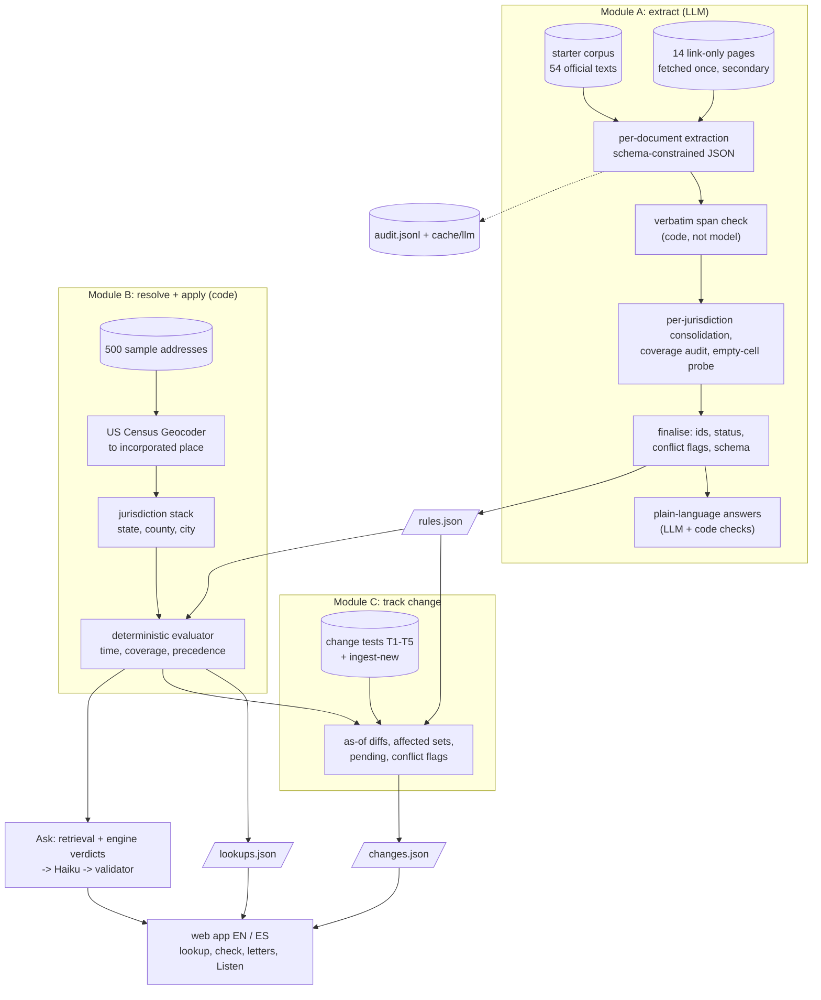

# Clause & Effect: Rental Housing Law Navigator

**Which housing rules apply to this apartment today, and what is about to change?**

[](https://github.com/isaaclins/rental-law-navigator/actions/workflows/ci.yml)
[](LICENSE)
[](https://navigator.isaaclins.com/)

Housing law in the US comes in layers: state statutes, then city ordinances, each with its own building tests and
dates. Clause & Effect reads the public law of 3 states and 10 cities (87 source documents) with an LLM. It turns
the text into rule records and checks every quote against the source in code. Each address is resolved to its
*legal* city, and a deterministic engine decides which rules apply on any date you pick. Renters and small landlords
get a one-line answer per topic, the source word for word one tap away, and a list of what changes next. They can also
check a rent increase, ask a question in plain English or Spanish, or draft a letter. **The model reads, code
decides:** every answer carries a citation, a retrieval date and an "as of" date. Built in 24 hours for the RealPage
challenge at the [Hack-Nation 7th Global AI Hackathon](https://hack-nation.ai/) (October 3-4, 2026).

**Live demo: <https://navigator.isaaclins.com/>** (a 60-second guided tour: <https://navigator.isaaclins.com/#/tour>) ·
[Method note](docs/METHOD_NOTE.md) ([PDF](docs/METHOD_NOTE.pdf)) · [Architecture](docs/ARCHITECTURE.md) ·
[Design notes](web/DESIGN.md)

> [!IMPORTANT]
> **Not legal advice.** This is a research prototype. It summarises public law from a fixed corpus (as of
> 2026-10-01) and is not a compliance check. Every answer links to its source; read the source before you rely on it.

| | | |
|---|---|---|
| [](https://navigator.isaaclins.com/) | [](https://navigator.isaaclins.com/#/a/A0016) | [](https://navigator.isaaclins.com/#/ask) |
| **Home** | **Address lookup** | **Ask the law** |
| [](https://navigator.isaaclins.com/#/check/A0016) | [](https://navigator.isaaclins.com/#/changes) | [](https://navigator.isaaclins.com/#/compare/A0016,A0048) |
| **Check a rent increase** | **What's changing** | **Compare two addresses** |
| [](https://navigator.isaaclins.com/#/rules) | [](https://navigator.isaaclins.com/#/properties) | [](https://navigator.isaaclins.com/#/audit) |
| **Rules by place** | **My properties** | **Sources and method** |

<p>


</p>

## Contents

[The brief, mapped](#the-brief-mapped) · [Results](#results) · [Run it](#run-it) ·
[Reproduce the outputs](#reproduce-the-outputs) · [How it works](#how-it-works) · [Ask the law](#ask-the-law-grounding-security-audit) ·
[Plain language](#plain-language-without-hand-writing) · [Try it with a new law](#try-it-with-a-new-law) · [Adding a jurisdiction](#adding-a-jurisdiction) ·
[Features](#features) · [Output files](#output-files) · [Limitations](#limitations) · [Videos](#videos) ·
[Team](#team) · [Repository layout](#repository-layout) · [License](#license)

## The brief, mapped

### Required modules

| Brief | What we built | Where |
|---|---|---|
| **Module A: rule extraction**, automated, in the provided schema | Claude reads each document and returns schema-constrained rule records plus a machine-readable `coverage` object. The prompts name laws only as examples (citation formats, two coverage examples) and pass the organisers' examples table from the brief and the starter README's open questions as labelled context ("the documents remain the source of truth"). Every rule is read from a document. Code checks every `quoted_span` verbatim against its document (one retry, then snap or drop). A per-jurisdiction pass merges duplicates, audits coverage and writes cited *no-rule findings*. After extraction, 16 reviewed field corrections ([`navigator/review_fixes.py`](navigator/review_fixes.py): titles, penalties, dates, key values) are applied, each only when code finds its supporting sentence verbatim in the source, and each logged in `audit.jsonl`. Result: 62 rules, 29 no-rule findings, 0 schema errors. | [`navigator/extract.py`](navigator/extract.py), [`navigator/prompts.py`](navigator/prompts.py), [`output/rules.json`](output/rules.json) |
| **Module B: address lookup**: jurisdiction stack, every applicable rule, local overrides, `unknown` instead of guessing | The US Census Geocoder places each of the 500 addresses in its incorporated place (38 have a mailing city that is not their legal city). The evaluator tests time, coverage (year built, units, use) and precedence. A state rule that yields to a local one becomes `superseded`; a missing fact gives `unknown` and names the fact (626 answers). | [`geo/resolve.py`](geo/resolve.py), [`navigator/evaluate.py`](navigator/evaluate.py), [`output/lookups.json`](output/lookups.json), the address page |
| **Module C: change tracking**: test cases, affected addresses, before/after, "as of" queries | Each change test compares two dates and lists the affected addresses, conflict flags and per-address before/after results. Every page and API call takes an as-of date. `ingest-new` runs a new ordinance through the same extraction and re-evaluates all addresses. | [`navigator/changes.py`](navigator/changes.py), [`output/changes.json`](output/changes.json), *What's changing*, the as-of picker |
| **Explain**: plain-language summary and citation for every applicable rule | Every topic has four layers: a one-line answer, a why line, *Show me the law* (the verbatim quote, citation, source link, retrieval date) and *More details*. | the address page, [`web/headlines.py`](web/headlines.py), [`navigator/plain.py`](navigator/plain.py) |

### Stretch goals

| Brief | What we built | Where |
|---|---|---|
| Plain-language view in English and Spanish | The whole app, Ask, Listen, letters and notices work in EN and ES. Citations and quoted law stay in the original English. Plain answers for rules without hand-checked copy are generated and checked by code ([below](#plain-language-without-hand-writing)). | EN/ES toggle, [`web/translations/`](web/translations/), [`web/static/i18n/es.json`](web/static/i18n/es.json) |
| Confidence score and conflict flag for each answer | Each rule in `rules.json` carries a `confidence`; each answer in `lookups.json` carries a `conflict_flag`. In the app, an uncertain reading shows "double-check this one" and a conflict shows "these laws may conflict", with the reason one tap away. 9 rules carry a conflict note, which flags 721 address answers. | `rules.json`, `lookups.json`, the status dots on each topic |
| Extend to one new jurisdiction during the event | Santa Monica, CA was added as data only: 5 documents, 40 parcels, 3 commands, about 2 minutes from documents to live answers; 18 model calls, $1.72 ([recipe](#adding-a-jurisdiction)). | [`new_docs/santa-monica/`](new_docs/santa-monica/), [`output/extension/santa-monica/`](output/extension/santa-monica/), [docs/NEW_JURISDICTION.md](docs/NEW_JURISDICTION.md) |

### Responsible AI

| The brief says the solution should / must not | How | Where to check |
|---|---|---|
| Cite the source text and retrieval date for every rule | Every rule has a citation, source URL, `retrieved_at` and a quote that code found in the source. Secondary sources (law-firm and news pages) are labelled as summaries. | *Show me the law* on every topic, `rules.json` |
| Show an "as of" date; keep enacted and pending law apart | The as-of date is on every answer, page and API response. `pending`, `not_yet_effective` and failed measures are their own results and never read as `applies`. | the as-of picker, T1, T3, T4, T5 |
| Say "unknown" when a fact is missing | Coverage tests run as code against parcel facts. A missing fact gives `unknown` and becomes one question to the user ("Was the building built before 1979?"); the answer re-runs the engine. | [`navigator/evaluate.py`](navigator/evaluate.py), the address page |
| Flag conflicts and low confidence for review | Conflict notes (NJ FAIR Act preemption, Berkeley's two dates, LA's two RSO dates, the CA screening-fee figure). Rules found only in sources we could not read are capped at confidence 0.4 and evaluate as `unknown`. | `conflict_note`, selfcheck section 6 |
| Plain language a renter can act on | One-line answers, a why line at grade 9 or below, a rent check with the deciding quote, a letter to the landlord, a spoken briefing. | the app |
| Keep an auditable log of sources, model outputs and changes | `output/audit.jsonl` logs every pipeline model call (prompt hash, model, raw output, cache hit, dropped candidates). `cache/llm/` stores every response. Ask writes its own redacted log ([below](#ask-the-law-grounding-security-audit)). | *Sources and method*, `/api/audit`, `/ask/audit` |
| Must not present output as legal advice or a compliance verdict | "Not legal advice" on every page, in the `X-Not-Legal-Advice` header of every API response, on every letter and in `rules.json` and `lookups.json`. Ask removes sentences such as "you are compliant". | footer, API, [`web/ask.py`](web/ask.py) `COMPLIANCE` |
| Must not suggest ways around a rule | Ask refuses questions about getting around a rule before any model call, quotes the rule and points to help. Model sentences that suggest a way around are dropped. The letter and notice are fixed templates. | [`web/ask.py`](web/ask.py) `EVASION`, [`tests/test_ask.py`](tests/test_ask.py) |
| Must not invent rules or citations | No rule is hand-coded; a quote not found in the source drops the record. The 16 reviewed field corrections need their own verbatim sentence too. In Ask, cited ids must come from the retrieved set and every number must appear in a cited source. | selfcheck sections 1-2, Ask validator |
| Must not use non-public data or scrape against terms | Only the starter corpus, public assessor data, the Census Geocoder and OpenStreetMap Nominatim (1 request/s, cached). Each link-only page was requested once, 2 s apart; pages that refused automated access were skipped, not worked around. | [`navigator/supplementary.py`](navigator/supplementary.py), [docs/NEW_JURISDICTION.md](docs/NEW_JURISDICTION.md) |

**Submission files:** [`output/rules.json`](output/rules.json), [`output/lookups.json`](output/lookups.json),
[`output/changes.json`](output/changes.json). Live demo: <https://navigator.isaaclins.com/>.

## Results

### Self-test score

The official `score.py` and held-out key are not in the starter pack. We wrote **our own independent key** by
hand from the corpus, separately from the pipeline: 59 rules, 19 no-rule findings and 61 sampled addresses, each with
a verbatim quote ([`qa/`](qa/)). It follows the brief's weights. **This is our key, not the official score.py.** It
cannot catch blind spots that the key and the pipeline share, and its findings drove extraction fixes, so the score
is partly fit to it.

```bash
python3 qa/score.py   # "independent key, not the official score.py"
```

| Component | Score | Max | Detail |
|---|---:|---:|---|
| Extraction accuracy | 24.7 | 25 | core rules 36/36, all 58/59, precision 98% |
| Address coverage | 20.0 | 20 | 968/968 points, 0 missed `applies`, 0 false positives |
| Citations | 14.7 | 15 | 4455/4545 `applies` answers quote the starter corpus verbatim (the other 90 quote fetched secondary pages) |
| Change tracking T1-T5 | 15.0 | 15 | T1-T5 all 1.00 |
| **Auto-scored total** | **74.4** | **75** | judged parts (plain language, responsible design, scalability) not included |

Full report: [`qa/report.md`](qa/report.md).

### Change tests

| Test | What a correct system does | Our result |
|---|---|---|
| **T1** CA AB 325 / SB 763 | `not_yet_effective` on 2025-12-31, `applies` on 2026-01-02, every CA address | 250/250 CA addresses flip |
| **T2** Hoboken and Jersey City bans | each ban only inside its own city, neither in Newark | 40 Hoboken + 50 Jersey City addresses, 0 in Newark |
| **T3** NJ FAIR Act (eff. 2027-07-01) | `not_yet_effective` today, `applies` on 2027-07-02, conflict with the local bans | 140/140 NJ addresses flip; 90/90 Jersey City and Hoboken addresses flagged |
| **T4** MA S.2983 / H.5222 | pending, never in force; list the addresses they would affect | both `pending`; 110/110 Boston and Cambridge addresses |
| **T5** MA ballot question, struck | no rent cap for Boston or Cambridge; affected set empty | recorded as `failed`; affected set empty |
| **T6** fictional Cambridge ordinance (hour 16) | — | *not part of the final challenge: the organisers dropped the hour-16 release (participant guide v5: "No surprise document or mid-event release is required"). The same path runs live: `ingest-new` takes a new ordinance through extraction, the quote check and all 500 addresses in about a minute, and Santa Monica was added as a new city in about 2 minutes.* |

`uv run python -m navigator selfcheck` re-checks schema, verbatim spans, the jurisdiction × category matrix, all 25
examples in the brief, T1-T5 and the four known open questions ([`output/selfcheck.txt`](output/selfcheck.txt)).
GitHub CI runs it on every pull request with the model binaries stubbed out.

### Tests

**Over 1,350 tests** (`pytest`, about a minute), covering the evaluator, rent check, letters, notices, Ask
(grounding, validator, evasion, budgets, redaction, dates), plain-language checks, sharing, Listen, accounts and
Spanish dates. Lint: `ruff check` and `ruff format --check` are clean.

## Run it

You need [uv](https://docs.astral.sh/uv/); it installs Python 3.12+ if needed. No API key is needed.

```bash
git clone https://github.com/isaaclins/rental-law-navigator && cd rental-law-navigator
uv sync
uv run uvicorn web.app:app --port 8765          # -> http://127.0.0.1:8765
```

From a fresh clone, `uv sync` takes about 3 s and the app answers in about 2 s. Everything except two features works
offline:

- **Ask** writes fresh answers with the `claude` CLI (or `ANTHROPIC_API_KEY`). Without either, it falls back to the
  quoted rules themselves.
- **Listen** uses ElevenLabs when a key is configured and the browser's own voice otherwise.

## Reproduce the outputs

```bash
uv run python -m navigator run-all     # extract (from cache) + plain + evaluate + changes + selfcheck -> "SELFCHECK: OK" (~8 s)
python3 qa/score.py                    # our independent key -> 74.4 / 75
uv run python -m navigator lookup A0016 --as-of 2027-07-02          # one address, any date
uv run --with pytest --with httpx python -m pytest tests -q         # the test suite
```

Every model response is stored in [`cache/llm/`](cache/llm/), keyed by `sha256(system prompt + prompt + schema)`;
geocoder responses are in [`cache/geo/`](cache/geo/). The offline rerun rebuilds `lookups.json` and `changes.json`
byte for byte. `rules.json` differs only in `generated_at`, `plain_language.json` only in its `cached` flags, and
`audit.jsonl` gets one more run appended.

**Rerun extraction with a live model:**

```bash
mv cache/llm cache/llm.recorded                      # force cache misses
uv run python -m navigator run-all                   # default: Claude Code CLI (claude -p --model sonnet)
NAVIGATOR_LLM=api ANTHROPIC_API_KEY=... uv run python -m navigator run-all   # or the Anthropic API
```

A cold run is about 106 model calls, about 10 minutes at 3 parallel calls. **A new law**, extracted unaided:

```bash
uv run python -m navigator ingest-new path/to/ordinance.txt --jurisdiction "Cambridge, MA" --url https://...
```

`ingest-new` extracts and consolidates the text (2 model calls) and adds the rules to `rules.json`. It then
re-evaluates all 500 addresses and adds a `new_law` change test with the affected addresses and before/after results
around the extracted effective date.

## How it works



1. **Extract (LLM).** Each document becomes rule records in the starter schema plus a `coverage` object: unit
   thresholds, construction cutoffs, exemptions, facts the data cannot show, and whether a state rule yields to local
   law.
2. **Verify (code).** Each `quoted_span` must occur in its document; the check ignores whitespace and quote style.
3. **Resolve (Census).** The mailing city is not the legal city: Dorchester is Boston, and a "Los Angeles" address
   can sit in West Hollywood. 486 batch matches, 7 single-line, 7 OpenStreetMap fallbacks.
4. **Apply (code).** Four tests per rule: time (pending, not yet effective, failed, sunset), coverage, precedence and
   conflicts. 500 addresses take 0.3 s for any date.
5. **Track change.** Change tests diff two dates; `ingest-new` adds a law in one command.

More depth: [docs/ARCHITECTURE.md](docs/ARCHITECTURE.md).

## Ask the law: grounding, security, audit

Ask ([`web/ask.py`](web/ask.py), [`web/ask_prompt.md`](web/ask_prompt.md)) answers a plain question in EN or ES,
across several turns. It is the one place where a model writes text at request time, so the model only gets to
phrase what our data already says.

| | |
|---|---|
| **Place** | One of our 500 addresses (fuzzy street match), else the cities or states named, else the address you looked up last, not one the tour or an example opened (shown above the input as "Asking about ..." with × to clear), else a short "which state?" choice. Places we do not cover are refused right away with the closest official source. Dates in the question ("in 2023", "el 1 de enero de 2027") set the as-of date. |
| **Applicability** | At an address, the deterministic engine decides what applies. The model explains those verdicts and never decides them. Building facts stated in the question ("My building in San Francisco was built in 1962 and has 20 units") go through the same engine; a build year is a fact about the building, never the as-of date. Without a building, a no-model answer says first when coverage depends on the build year. |
| **Maths by code** | Stated increases ("10% twice this year", "$300 more on $2,000") are added up and checked against the governing cap by code ([`web/ask_increase.py`](web/ask_increase.py)); the dollar line ("10% of $1,450 is $145, so the rent would go from $1,450 to $1,595") is computed, never written by the model. |
| **Retrieval** | BM25 over the extracted rules, the no-rule findings and passages of the source documents, filtered by place and topic. Every retrieved quote is checked against its source text. |
| **Model** | Claude **Haiku** through the `claude` CLI in headless mode: `--tools ""` (no tools), no session persistence, no MCP servers, no slash commands, a temporary working directory, strict JSON out. A 12 s hard timeout kills the process tree. |
| **Every law sentence cited** | The prompt allows only the SOURCES of this turn. The server-side validator then keeps a sentence only if its cited ids come from the retrieved set, a sentence about the law has a citation, and every number appears in a cited source or the question. It also drops sentences that contradict the engine at an address, claim a rule not yet in force applies, read as a compliance verdict, suggest a way around a rule, or contain markup, links, paths or e-mail addresses. Streamed partial answers pass through the same validator. If nothing survives, the reply is an honest "I don't have that in my sources" with the official source. |
| **Prompt injection** | The question and the conversation are passed as untrusted text. The prompt tells the model to ignore instructions inside them and never reveal its context. The model has no tools, so the worst case is a sentence the validator drops. |
| **No evasion help** | Questions about getting around a rule ("how do I raise the rent above the cap") are caught before any model call. They get a kind refusal, the rule itself quoted and where to get help. |
| **Urgent situations** | Lockouts, shut-off utilities, eviction papers with a date: help contacts come first. |
| **Budgets** | At most 3 model processes at once, and background checks of follow-up chips may use only 1 of them. Fresh calls are capped at 1,200 per hour and 8,000 per day, with the counter kept on disk across restarts. A question waits at most 5 s for a slot. Busy, over budget or timed out, the answer falls back to the quoted rules, with no model involved. Per-visitor limits can be set by environment variable and are off by default. |
| **Audit log** | One JSON line per model answer in `output/ask_audit.jsonl`: time, prompt hash, model, language, as-of date, the **redacted** question, place, topics, retrieved ids, engine verdicts, the answer, cited ids, and every sentence the validator dropped with the reason. Redaction removes e-mail addresses, phone numbers, street addresses and unit numbers. Reviewers see a public summary at `/ask/audit` (linked from *Sources > For reviewers*): place, topics, retrieved ids, verdicts, citations kept and how many sentences were removed and why, but no question or answer text. The log is not in git. |
| **Caching** | Answers are cached in memory. Only the suggested questions are pre-warmed to disk (`cache/ask/`, not in git). |
| **Errors** | Offline, busy or too slow: a plain message ("You're offline. Check your connection and try again.") with Retry, in EN and ES. Off-topic questions and injections ("write me a poem", "what is 2+2?") get a short "I can only help with renting questions" instead of a place prompt; a renting question no rule of ours covers ("my heat is broken") gets "I don't have that in my sources" with an official link. |
| **Conversation** | Follow-ups keep the place and topic of earlier turns; "what did I ask you first?" quotes your own question back. After an answer, focus stays in the follow-up box (on phones, on the answer card, so the keyboard does not cover it), and the answer is read out by screen readers through a polite live region. |
| **Red-team eval** | 129 adversarial questions (wrong city, made-up laws, expired figures, dates, Spanish, injections, dollar maths) are re-asked against the live API after every Ask change and graded by hand against `rules.json` and the engine. Each failure became a validator rule and a test: frequency drift ("once a year" for a 12-month total), invented exemptions or "at least", expired figures called current, date maths, felony/misdemeanor for NJ degrees, a preemption decided where the sources leave it open, wrong-language replies, "before Measure BB" history the sources don't give, "current rent" where the law says "base rent". Without a model, a "how much" question leads with the rule that has the figure. |

Tests: [`tests/test_ask.py`](tests/test_ask.py) covers retrieval, the validator, evasion and compliance phrasing,
budgets and slots, redaction, dates, the default place, the dollar maths and one test per eval round.

## Plain language without hand-writing

The short answers ("Max 1 month's rent.", "Not law yet: on the Nov 3, 2026 ballot.") have two sources. Hand-checked
copy in [`web/headlines.py`](web/headlines.py) always wins: 53 of the 62 rules have it. The other 9 get one
model call ([`navigator/plain.py`](navigator/plain.py)) that sees **only that rule's own fields** and its verbatim
quote. Code then checks the copy:

- every number, amount, percent and date occurs in the rule's key value, requirement or quote;
- length limits, a why line at Flesch-Kincaid grade 9 or below, and no jargon (§, CPI, "exempt", "shall", bill
  numbers);
- the answer matches the status (pending: "Not law yet"; not yet effective: names the start date);
- the why line stays on the rule's topic;
- the Spanish copy carries the same numbers and dates.

A failure gets one retry with the list of failed checks. A second failure falls back to a category template marked
`needs_review` (3 rules today). Generated answers carry a small "Auto-summary" note in the app. In a blind comparison
against the hand-written copy, 11 of 12 generated answers carried the same facts ([`output/plain_compare.json`](output/plain_compare.json)).

## Try it with a new law

`#/try` (linked from *Sources > How it works* and the Rules page) lets anyone run a law through the pipeline live.
Paste an ordinance or a statute, upload a `.txt`, `.pdf` or `.html` file, or pick one of two samples: Santa Monica's
security deposit chapter (real, from santamonica.gov) or a Newark "fair rent-setting" ordinance written for this
demo (labelled fictional in the text and on the page). Pick where it applies (the page guesses it from the text):
one of our places or any other US city. Each step streams with its timing:

1. **Read the law** (AI): `extract.stage1`, the batch prompt and schema, with the same verbatim check and span-fix retry.
2. **Check every quote** (code): each quote is searched in your text, word for word, and shown in context.
3. **Consolidate and check dates** (AI): `review_new_doc` + `date_audit` against our existing rules for that place
   (the `ingest-new` path), so a conflict with state law is flagged.
4. **Validate** (code): `finalize` + `rule_record.schema.json` + the selfcheck's record checks (ids, statuses, dates).
5. **Write the plain answer** (AI): `plain.generate`, EN + ES, numbers and dates checked by code.
6. **Apply to our buildings** (code): the rules engine runs every sample building in that place with and without the
   new rules and lists what changes (before → after). **Download rules.json** gives the records in our format.

Code: [`navigator/trylaw.py`](navigator/trylaw.py) (also `python -m navigator try law.txt --jurisdiction "Newark, NJ"`)
and [`web/trylaw.py`](web/trylaw.py). The run happens in a child process with a scratch output folder:
`output/`, `cache/llm/` and the live rules never change. When the text is one of ours (the Santa Monica sample), the
comparison leaves our copy out, so you see the city without it and with it.

| | |
|---|---|
| **Limits** | 200 to 30,000 characters, files up to 3 MB (PDF text via `pdftotext`; a scanned PDF has none). 6 fresh runs per visitor per hour, 2 at once, 30 per hour and 150 per day overall (the Ask budget counter, its own file). A 240 s timeout kills the whole process tree and says so. Busy or over budget, the samples still work. |
| **Prompt injection** | The text is data: it sits inside the pipeline's `<document>` block with a framing line, tags that would close the block are neutralised, the `claude` CLI runs with no tools and a JSON schema, the output is schema-validated and every quote is checked by code. Lines that talk to an AI ("ignore previous instructions", `</document>`) are shown to the reader. Tested with such a text: the real $30 fee rule came out, the injected rules did not. |
| **Privacy** | Nothing pasted is kept. The scratch folder (text, model cache) is deleted after each run. Only a SHA-256 of the text + place + pipeline version and the result are stored (`cache/try/results/`, not in git), so the same text answers instantly. The page says so under the input. |
| **Timings** (2026-10-04, `claude -p --model sonnet`) | Cold: 57 s for the Newark sample (5 model calls), 61 s for Santa Monica (4 calls), 54 s for a pasted Cambridge text; about $0.12 each. Cached: about 1 s. Both samples are prewarmed (`web/fixtures/trylaw/*.result.json`, rerun them after a prompt change: `tests/test_trylaw.py` fails until then). |

Not legal advice: the page says so in English and Spanish, and the download carries the same disclaimer.

## Adding a jurisdiction

A new city needs data, not code: a `jurisdiction.json` (name, state, rule-id code, Census place) and a few official
texts with a manifest in `new_docs/<slug>/`. Choosing the sources is the one human step
([docs/NEW_JURISDICTION.md](docs/NEW_JURISDICTION.md)). Then:

```bash
python3 geo/lacounty_parcels.py "SANTA MONICA" new_docs/santa-monica/addresses.csv --n 40 --prefix SM   # 1. addresses
python3 geo/resolve.py --extension new_docs/santa-monica                                                # 2. legal city per address
NAVIGATOR_EXTENSION=new_docs/santa-monica nice -n 19 uv run python -m navigator extend                  # 3. rules -> plain -> lookups
```

**Measured end to end** (Santa Monica, 2026-10-04, cold caches, `claude -p --model sonnet`, 3 parallel calls):

| Step | Wall time |
|---|---:|
| 1. 40 parcels from the LA County parcel layer (2 requests) | 1.8 s |
| 2. Census batch geocoding (39 matched, 1 postal-city fallback flagged) | 12.4 s |
| 3. `extend`: 5 documents -> rules -> plain answers -> 40 address lookups | 109.4 s |
| 4. web app start + first Santa Monica answer | 1.7 s |
| **Documents -> live answers** | **about 2 minutes** |

The first `extend` run took 124 s ([docs/NEW_JURISDICTION.md](docs/NEW_JURISDICTION.md)). The committed
[`summary.json`](output/extension/santa-monica/summary.json) records the model work: 18 calls (9 extraction, 9 plain
language), $1.72 in total.

**Ask picks it up automatically.** No code change and no list to edit: on the next question (or after a restart)
Ask reads every `output/extension/<slug>/` and `new_docs/<slug>/jurisdiction.json`
([`web/ask_ext.py`](web/ask_ext.py)). The new city's rules and "no rule" findings join retrieval. Its name, postal
cities and optional `"aliases"` from `jurisdiction.json`, plus the ZIP codes of its addresses, are recognised in
questions. Its addresses run through the same rules engine (`navigator.api.extension_lookup`). The scope message
and the "Where do you rent?" chooser list it, and a suggestion for it appears on the Ask page. A city that
`ingest-new` adds to `rules.json` is recognised from the rules' own `jurisdiction` field. Tested end to end in
`tests/test_ask.py::test_a_city_added_later_is_answered_with_no_code_change` (a fixture city) and by rerunning
the recipe above for Santa Monica in a scratch checkout.

The committed extension has 6 Santa Monica rules (rent control, just cause, two pending ballot measures, deposit
interest, algorithmic pricing). A rerun from cache takes under 1 s. The evaluator names no specific law and a city's rules come
only from its own documents, so adding a city never changes an existing answer. Model work grows with the number of documents. Evaluation is plain
code and grows with addresses × rules.

## Features

| Feature | What it does |
|---|---|
| **Address lookup** | Jurisdiction stack, building facts, one plain answer per topic, the law one tap away. A city or ZIP search that opens a sample address says so ("Example address in Boston"); picking a street from the list does not. Unknowns become one question. One topic opens at a time; type your rent once and the rent and deposit topics answer in dollars ("Most they can ask: $2,032 a month"), and the rent check starts with it. "Show me the law" always has a quote: when no rule covers the building it quotes the in-force law that doesn't (and says why) or the cited finding that there is no such law; with no law at all on that date the link is left out. |
| **Any address in CA, NJ or MA** | Not only the 500 samples: the live Census geocoder finds the legal city of any address in California, New Jersey or Massachusetts, and you add the building facts the answer depends on. Local rules cover the 10 cities plus Santa Monica; elsewhere in those states the answer uses state law and says so. An address in another state is named and refused plainly ("Illinois isn't covered yet. We cover California, New Jersey and Massachusetts."), even when the geocoder can't find the street. |
| **As-of date** | Every page re-evaluates for any date, from 2019 to 2027. |
| **Ask the law** | Conversational questions in EN/ES, grounded in our rules, every sentence about the law cited ([above](#ask-the-law-grounding-security-audit)). |
| **Check a rent increase** | Deterministic verdicts for a rent increase, deposit, fee, notice or termination, each with the deciding quote. The address field lists sample addresses as soon as you tap it and filters from the first letter (arrows, Enter, Esc); picking one moves on to the rent field. Plain amounts read as money ($2,300) once you leave a field or press Enter. A rent carried over from "My rent now" is marked as such and selected on focus, so typing replaces it; an amount above the limits says it looks too high for a monthly rent, a negative or non-numeric amount gets its own message under the field as soon as you leave it (EN/ES), and the message and the Check button stay clear of the phone tab bar. Optional dates add the notice check; "Listen" reads the verdict aloud with the device voice. Under a "5% + CPI" cap an increase within the 5% reads "Allowed" (as in Ask) without the CPI figure; where the city's yearly % is not in our sources the check says so and points to the published figure. |
| **Letter to the landlord** | When a check finds an increase over the limit: a fixed EN/ES template filled only from the engine's numbers. Name and unit stay in the browser. Copy, print, PDF or share, or listen to it (device voice, so the names never leave the phone). The PDF uses the site's fonts, puts the landlord's address in a #10 window-envelope position, adds a rent table, the shaded law quote with citation and retrieval date, numbered sources and a QR code to the public answer. |
| **Rent-increase notice** | For owners, the twin of the letter: the highest lawful rent, the earliest start date and the notice deadline, checked against our sources. Same PDF layout as the letter. The paper shows text lines at about its final height while it is written (no layout shift) and paints in its own language first; a new rent at or below the current one is never printed as an "increase"; "Notice in: EN | ES" (and "Letter in") sets the document's language, apart from the site's. A wrong amount (negative, text, a new rent below the current one) says so under its field and keeps the last good draft; each check names its status in words (Checked, Problem, Note), and every control is a 44 px target on touch. A date that doesn't exist (Feb 31) is flagged in every date field (check, notice, letter) as soon as typing pauses, never rolled over or replaced. The My properties tab stays active on the notice. |
| **What's changing** | A timeline of laws taking effect or ending, by place, with the addresses each affects. Also a chart of how many cities have each protection, 2019-2027; its year labels thin out on narrow screens instead of running together, and each step is a finger-wide target on touch. |
| **Rules by place** | Pick a state or city and its six topics answer with the same component as the address page (no building, so no status dots). On tablets the place chips are 44 px targets. |
| **Compare** | Two addresses side by side, topic by topic; an opened topic shows each side's law with the first four lines of its quote and the citation link. Tapping the address field lists sample addresses in other cities. |
| **Listen** | A 35-50 s spoken briefing for renters or owners (EN/ES), with a time-synced transcript. Deterministic templates, no LLM. ElevenLabs voice, budgeted and cached, with a browser-voice fallback. |
| **Share an answer** | A frozen, cited permalink with a link-preview card, recomputed from the address, topic and date. No database. A building in My properties shares its rent answer the same way. |
| **My properties** | Google sign-in, saved buildings, next lawful rent increase, open questions, an ICS calendar feed and e-mail alerts before a law change. A read-only example portfolio for visitors. |
| **Try it with a new law** | Paste, upload or pick a sample law: the pipeline extracts it live, checks every quote against your text, writes the plain answer and shows which sample buildings change, with a rules.json download ([above](#try-it-with-a-new-law)). |
| **Sources and method** | The pipeline audit log, every source text, how each address was geocoded, and the Ask audit log. |
| **Product tour** | A 60-second guided walk through the live app (`#/tour`). |
| **On a phone** | Below 600 px the app is laid out for one thumb: the sources line and the header are one solid block at the top (below the iPhone status bar, never under its blur) that slides away while you scroll and returns when you scroll back; a new address page starts at the top and its photo and title stay put while the lookup finishes; pills are one line with the host shortened (ca.gov); a five-tab bar whose highlight moves the moment you tap (also right after rotating), every answer a card with a status dot that presses like a button, the rent answer first with its why line and source, and a shared answer that opens on the quoted law. From 320 px wide nothing runs off the screen in English or Spanish (long addresses and place names end in "…", the update notice wraps). At 200% text zoom the tabs turn into icons, the photo's answer chips step aside (the cards below say the same) and nothing scrolls sideways. |
| **Installable app** | A PWA that keeps recent answers readable offline. The offline page (EN/ES, Retry) lists them and appears only when there really is no connection. A mistyped URL or in-app link gets the same in-app "Page not found" (HTTP 404 for URLs, EN/ES, tab bar, links to Lookup and Ask); `/api/*` keeps JSON errors. The service worker registers even with Cloudflare Rocket Loader on (it hides the page's load event). |
| **Navigation** | Back buttons go to the page you came from and name it ("‹ Ask", "‹ Check a rent increase"); only a direct link falls back to the parent page. Fast taps and Back/Forward never leave an older page painted. The "As of" date pill is one keyboard stop (Enter or Space opens the calendar). Links may carry a query: `#/a/A0001?topic=rent_increase_limits` opens that address with the topic open; a query never becomes part of an id on any route. |
| **Spanish** | Every page, Ask, Listen, letters, notices and PDFs in es-US. Citations and quoted law stay in the original English. |

## Output files

All in [`output/`](output/) and committed, so CI validates exactly what the demo shows.

| File | Contents |
|---|---|
| [`rules.json`](output/rules.json) | **Submission.** 62 schema-valid rules (57 in force, 1 not yet effective, 2 pending, 2 failed), each with citation, source URL, retrieval date, verbatim quote, confidence, conflict flag and `coverage`; plus 29 cited `no_rule_findings`. |
| [`lookups.json`](output/lookups.json) | **Submission.** For all 500 addresses, every rule's result (`applies` 4545, `unknown` 626, `superseded` 265, `pending` 220, `not_yet_effective` 140) with explanation, citation and conflict flag. |
| [`changes.json`](output/changes.json) | **Submission.** Per test: affected addresses, conflict-flag addresses, per-address before/after, and the mapping to our rule ids. |
| [`audit.jsonl`](output/audit.jsonl) | One line per model call and pipeline step: prompt version and hash, model, cache hit, raw output, dropped or restored candidates. |
| [`plain_language.json`](output/plain_language.json) | Plain answers per rule (EN + ES): reviewed or generated, with model, prompt hash, every check result and `needs_review`. |
| [`rules_raw.json`](output/rules_raw.json), [`rules_reviewed.json`](output/rules_reviewed.json) | Candidates before and after consolidation. |
| [`selfcheck.txt`](output/selfcheck.txt) | The selfcheck report. |
| [`extension/santa-monica/`](output/extension/santa-monica/) | The added jurisdiction: rules, lookups, changes, plain answers, `summary.json` with time and cost. |

**Why `no_rule_findings` is a separate list.** The brief tests whether systems avoid reporting rules that don't
exist, such as rent control in Massachusetts cities. The schema has no "no rule" status, and a finding stored as a
rule would read as `in_force`. So findings carry `status: "no_rule"`, a citation and a verbatim quote, and are never
evaluated against addresses.

## Limitations

- **Our score is our own.** The key was written by us, no lawyer reviewed it (nor the starter pack's), and it drove
  fixes. It is a regression test, not a grade.
- **Jersey City and Hoboken algorithmic bans rest on secondary sources.** The corpus links to the ordinances but has
  no text, so those rules quote law-firm or news pages (90 `applies` answers).
- **Unreadable link-only law evaluates as `unknown`.** Hoboken and Newark rent control and San Diego's
  source-of-income ordinance sit on code-publisher sites that refuse automated access. Their quotes come from a state
  page, not the city's own code, so wherever the quote is shown (address page, rules, Ask, share page) an amber
  "Source unclear" note says so instead of "Word for word"; the same goes for LA's deposit-interest rule, whose
  official page gives only a heading ([`web/source_notes.py`](web/source_notes.py)).
- **Parcel data decides a lot.** 212 of 500 addresses have no year built and 242 no unit count. Owner type, owner
  occupancy and subsidies are not in the data, so exemptions that depend on them are listed but not tested.
- **Annual figures are dated by the current figure.** SF's 1.6% allowance starts 2026-03-01, so an earlier as-of
  date shows it as `not_yet_effective`, not last year's figure.
- **Some old statutes give no effective date** (for example N.J.S.A. 2A:18-61.1), so the field stays empty.
- **The corpus is frozen at 2026-10-01.** Change tracking covers documents you ingest; it does not watch
  legislatures.
- **Ask is guarded, not proven.** The validator checks citations, numbers and phrasing, not whether a paraphrase is
  a fair summary. Its redaction is pattern-based (e-mail, phone, street, unit); a name typed into a question is not
  removed. It needs the `claude` CLI or an API key for fresh answers.
- **Try it with a new law reads one text at a time.** It knows our rules for the place but not the rest of a new
  city's law, it covers our six topics only, and a model may miss a rule; the quote check catches invented wording,
  not omissions.
- **Generated plain copy is marked for review** until a person checks it; 3 rules use a template today.
- **Santa Monica's algorithmic-pricing ordinance** has no official text in the extension (the city's legislative
  system never answered), so that rule quotes a news page.

## Videos

| Video | Link |
|---|---|
| Team introduction (≤ 60 s) | *link follows* |
| Product demo (≤ 60 s) | *link follows* |
| Technical walkthrough with scores (≤ 60 s) | *link follows* |

## Team

**Clause & Effect** is Isaac Lins and a fleet of AI agents. Isaac set the direction and the quality bar; the agents
built it in parallel. Each issue on the [project board](https://github.com/users/isaaclins/projects/6) went to its
own agent in its own branch and git worktree. Before a merge, the agent runs the full test suite locally, one merge at
a time under a lock (GitHub CI does not run pytest). Pull requests on GitHub merged only with green
[CI](.github/workflows/ci.yml) (lint, schema and span validation, offline selfcheck with the model binaries stubbed,
web smoke test). A separate QA agent wrote the answer key by hand, and critic agents reviewed the design and the
brief's requirements before each merge.

## Repository layout

```
navigator/   pipeline: corpus, LLM extraction + span check, plain language, evaluator, change tracking, selfcheck, CLI
geo/         address -> legal jurisdiction (Census Geocoder, LA County parcels; cached)
web/         FastAPI app (lookup, check, Ask, letter, notice, share, Listen, accounts) + build-free single page (EN/ES)
qa/          independent answer key, scorer, report (test oracle, not product code)
tests/       pytest suite + Playwright screenshot scripts (shots_*.py)
scripts/     validate_outputs.py (schema, spans, coverage; runs in CI)
output/      rules.json, lookups.json, changes.json (+ audit log, plain language, selfcheck, extension)
cache/       recorded LLM and geocoder responses for offline, reproducible runs
data/        addresses_resolved.csv (sample addresses + legal city, county, method, confidence)
new_docs/    the added jurisdiction (Santa Monica): documents, manifest, addresses
supplementary/text/   link-only sources fetched once (secondary, flagged as such)
starter/     the organisers' starter pack, unmodified
docs/        method note, architecture, new-jurisdiction notes, challenge brief, screenshots
```

## License

Code: [MIT](LICENSE) © 2026 Isaac Lins. The [`starter/`](starter/) pack and
[`docs/challenge-brief.txt`](docs/challenge-brief.txt) belong to the challenge organisers and are included unmodified
for reproducibility. Law texts are public records. Fonts: Inter and Instrument Serif (SIL OFL). Street photos and
illustrations are AI-generated for this project.

## Acknowledgements

- [RealPage](https://www.realpage.com/), for the challenge, the corpus and the starter pack.
- [Hack-Nation](https://hack-nation.ai/), for the 7th Global AI Hackathon, and the ETH AI Club for co-hosting the
  [Zurich hub](https://luma.com/xi9z9ikg).
- US Census Bureau Geocoder; assessor open data from LA County, DataSF, NJOGIS and MassGIS; geocoding fallback
  © OpenStreetMap contributors (ODbL).
