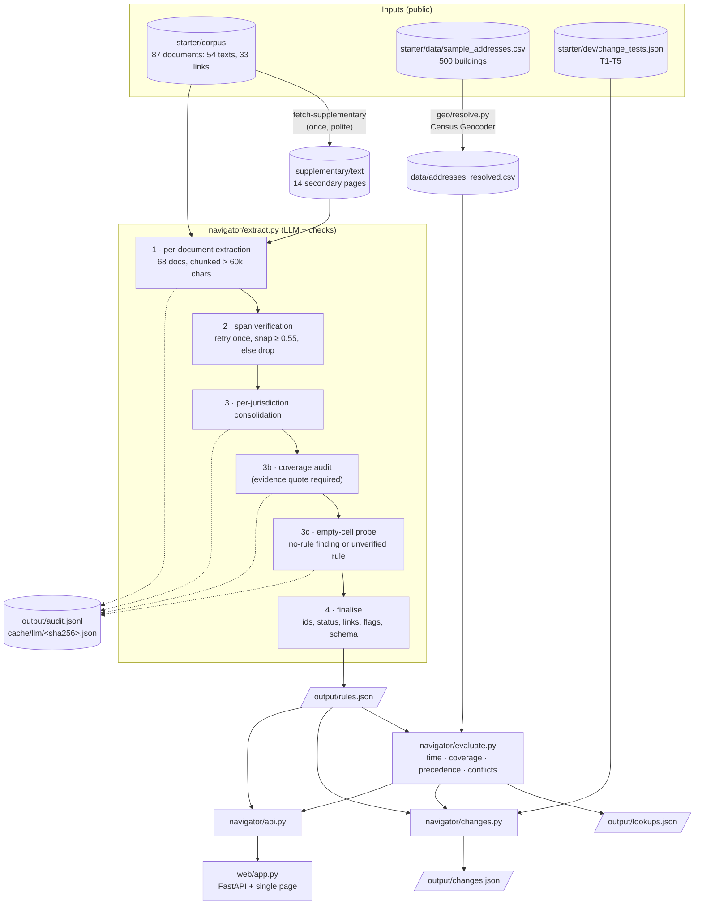

# Architecture

> **Not legal advice.** This document describes a research prototype.

The design rests on one rule: **the model reads, code decides.** An LLM turns legal text into structured records.
Everything after that is deterministic code that can be tested and repeated:

- checking each quote against the source;
- resolving an address to its legal city;
- deciding which rules cover a building on a given date;
- diffing results between two dates.

The model never decides whether a rule applies. Where it writes for a renter (generated plain-language answers,
*Ask the law*), it only rephrases rule records and the engine's verdicts, and code checks every cited id and number
([README](../README.md#ask-the-law-grounding-security-audit)).

## Module A: rule extraction

Code: [`navigator/extract.py`](../navigator/extract.py), [`navigator/prompts.py`](../navigator/prompts.py),
[`navigator/corpus.py`](../navigator/corpus.py), [`navigator/normalize.py`](../navigator/normalize.py).

**Inputs.** The 54 official texts in the starter corpus, plus 14 of the 33 link-only pages. Those pages were fetched
once by `python -m navigator fetch-supplementary`: one at a time, 2 s apart, with no crawling. Pages that refuse
automated access are skipped. Every text keeps its URL and retrieval date. Secondary pages (law firms, news) are
labelled as such all the way through to the UI.

**Prompt context.** The prompts define an output contract: the starter schema fields, the `coverage` object, citation
style and the jurisdiction list. As organiser context they also pass the brief's category examples table
([`docs/challenge-brief.txt`](challenge-brief.txt)) and the starter README's open questions. The prompts name laws
only in citation-format and coverage examples and in that labelled organiser context; every rule must come from a
document. After extraction, 16 reviewed field corrections (`navigator/review_fixes.py`) are applied, each only when
code finds its supporting sentence verbatim in the source, and logged in `audit.jsonl` (stage `review_fix`). Responses are constrained to a JSON schema (`--json-schema`
with the Claude CLI).

| Stage | Calls (current run) | What happens |
|---|---:|---|
| 1. Per-document extraction | 71 | Each document, or each 45k-character chunk with 2k overlap for documents over 60k, returns candidate rule records and candidate no-rule findings. |
| 2. Span verification | 0 (code) | Each `quoted_span` must occur in its document. The match ignores whitespace and quote style, and the exact original substring is stored. A failed span goes back to the model once ("copy it exactly"). If it still fails, it snaps to the closest exact sentence with similarity ≥ 0.55; otherwise the record is dropped. Citations, dates and jurisdictions are normalised (`Civil Code section 1947.12` becomes `Cal. Civ. Code § 1947.12`). |
| 3. Consolidation | 13 | One call per jurisdiction. It sees every candidate and the full text of that jurisdiction's documents, merges duplicates, fixes coverage objects, re-reads documents for empty categories and records no-rule findings. |
| 3b. Coverage audit | 13 | A second look at coverage objects only. A changed value is accepted only with a verbatim evidence quote that verifies against a document. |
| 3c. Empty-cell probe | 9 | Each jurisdiction × category cell that is still empty ends as either a cited no-rule finding or an `unverified_link_only` rule. The second case is for law that exists only behind a link we could not read; such rules get confidence ≤ 0.4, a conflict flag, and always evaluate to `unknown`. |
| 4. Finalisation | 0 (code) | Ids (`CA-RENT-01`; `MA-ALG-P1` for proposals); status as of 2026-10-01 (`in_force`, `not_yet_effective`, `pending`, `failed`); `overrides` and `interaction` links between state rules and the local rules they yield to or may preempt; conflict flags; JSON-schema validation. |

Every call writes an `audit.jsonl` line: stage, document or jurisdiction, prompt version, prompt hash, model, cache hit,
raw output, and any dropped or restored candidates.

### The coverage object

The starter schema's `coverage_conditions` is free text. A program cannot evaluate free text, so each rule also carries
a `coverage` object. The prompt tells the model exactly which facts the parcel data has: state, legal city, year built
(often missing), unit count (often missing) and use code. Nothing else.

| Field | Meaning | Example |
|---|---|---|
| `min_units` / `max_units` | Unit-count thresholds | Jersey City rent control: 5+ units |
| `construction_cutoff` | `{basis, covered_if, date}` | SF Rent Ordinance: CO on or before 1979-06-13 |
| `new_construction_exemption` | Rolling exemption `{years, basis, requires_owner_filing}`; an exemption that needs an owner filing gives `unknown` | CA: 15 years; Jersey City: 30 years |
| `owner_occupied_exemption_max_units` | Exempt when owner-occupied up to N units | CA AB 1482: owner-occupied duplex; NJ Anti-Eviction Act: up to 3 units |
| `requires_unknown_facts` | Coverage needs facts that are not in the data, giving `unknown` | SF Fair Chance: affordable housing only |
| `unverifiable_exemptions` | Exemptions that hinge on facts not in the data (informational, not tested) | AB 1482 single-family homes with notice |
| `yields_to_local_rule` / `supersedes_state_rule` | Precedence, giving `superseded` | CA rent cap yields to SF ch. 37 |
| `may_preempt_local_rules` | State law that may override local ordinances, giving a conflict flag | NJ FAIR Act vs. Jersey City / Hoboken; MA G.L. c. 40P |

### No-rule findings

`rules.json` has two lists. `rules` holds the schema-valid records, including pending bills and failed measures.
`no_rule_findings` holds records with `status: "no_rule"`, a citation and a verbatim quote. The schema has no "no rule"
status. Writing a finding as an `in_force` record would claim a rule exists exactly where the key says it does not, and
the MA rows of the brief test exactly that. Findings are shown in the app but never evaluated against addresses.

## Module B: address lookup

### Jurisdiction resolution ([`geo/resolve.py`](../geo/resolve.py))

The postal city is the USPS mailing name. The law that applies follows the *incorporated place*.

1. Normalise street strings (`1031-1035 CLINTON ST` becomes `1031 CLINTON ST`, `AV` becomes `AVE`, unit suffixes are
   dropped) and drop ZIP codes that cannot belong to the postal city.
2. Run the Census batch geocoder, then Census `geographies/coordinates` for each matched point. That gives the
   incorporated place, county and county subdivision.
3. For addresses with no match: try single-line Census queries over address variants, then OpenStreetMap Nominatim
   (1 request/s) to get coordinates, then Census for the place.
4. Last resort: the postal city, with a note and low confidence. This was needed for 0 of 500 addresses.

Result: 486 batch matches, 7 single-line, 7 via OpenStreetMap. 38 addresses have a mailing city that is not their legal
city: Dorchester, Roxbury, Allston, Brighton, Hyde Park and others map to Boston, and San Ysidro maps to San Diego. Each
row keeps its method, confidence and a plain-language note, and the UI shows them under "How we found it". Every raw
response is cached in `cache/geo/`.

### Evaluator ([`navigator/evaluate.py`](../navigator/evaluate.py))

For each address, the jurisdiction stack is the state plus the resolved city. Each rule of those jurisdictions goes
through four tests:

1. **Time.** Failed measures, laws enacted after the query date and laws past their sunset date are omitted. A pending
   bill gives `pending`. A law that takes effect after the query date gives `not_yet_effective`.
2. **Coverage.** The `coverage` object is checked against year built, unit count and use code. Units come from the
   assessor count, or are inferred from use codes: `6B-20U-G` means 20 units, NJ class 4C means 5+, `4-8-UNIT-APT`
   means 4-8. Covered gives `applies`, excluded is omitted, and a missing fact gives `unknown`. A building whose year
   built equals the cutoff year is `unknown`, because the certificate date decides.
3. **Precedence.** A state rule that yields to local law becomes `superseded` where a local rule of the same category
   applies. Two local ordinances can split all buildings at one construction date between them (LA's RSO and JCO).
   Then the state just-cause rule is `superseded` even when the year is unknown, because one of the two governs either way. If
   local coverage is unknown otherwise, the state rule is `unknown`.
4. **Conflicts.** A state rule that may preempt a local rule sets `conflict_flag` on both, with a note naming the other
   rule. So do open questions and unverified sources.

When the choice is between omitting a rule and answering `unknown`, the evaluator answers `unknown`: missing an
applicable rule is the worse error. Every entry carries a generated plain-language `explanation` that gives the reason
("built 1926: meets the cutoff (certificate of occupancy on or before 1979-06-13)").

It is pure Python with no I/O in the loop: 500 addresses × 62 rules for one date take about 0.3 s. That is why the web
app can re-evaluate any date live.

## Module C: change tracking ([`navigator/changes.py`](../navigator/changes.py))

The test rule ids (`CA-ALG-01`, `HOB-ALG-01`, `MA-ALG-P1`, ...) are matched to extracted rules by jurisdiction code,
category code and enacted-or-proposal type. The mapping is written into `changes.json`.

| Test type | Computation |
|---|---|
| `as_of` (T1, T3) | Evaluate both dates and diff them. Affected means the result changed. Conflict flags are collected per address. |
| `boundary` (T2) | Addresses where each rule applies. Each rule must stay inside its own city. |
| `pending` (T4) | Addresses the bill would cover if enacted. The result stays `pending`. |
| `negative` (T5) | The affected set must be empty. The measure is recorded as `failed`. |
| `new_law` (T6, via `ingest-new`) | Before and after results around the effective date that was extracted from the new text. |

`ingest-new <file>` registers the file in `new_docs/manifest.csv` and runs stage 1 on it. It then consolidates the
candidates against the existing rules of that jurisdiction (`review_new_doc`), finalises, validates, re-evaluates all
addresses and writes the new test. Existing rules are not re-extracted.

## Reproducibility and audit trail

- **Content-addressed LLM cache.** `cache/llm/<sha256(system + prompt + schema)>.json` stores the parsed output, raw
  text, model, backend, seconds and timestamp. The same inputs always produce the same outputs. Any change to a prompt
  or document misses the cache, and only that call goes to the model.
- **Backends** ([`navigator/llm.py`](../navigator/llm.py)): Claude Code CLI (`claude -p --model sonnet`, default), the
  Anthropic Messages API (`NAVIGATOR_LLM=api` with `ANTHROPIC_API_KEY`) and `codex exec` as a fallback. At most 3
  calls run in parallel, each under `nice -n 19`. Each call is retried up to 2 times before the next backend.
- **Audit log.** `output/audit.jsonl` holds one line per model call and pipeline step, including the raw model output.
  The web app's *Audit & sources* page and `/api/audit` show it, along with the source text of every document
  (`/api/source/<doc_id>`).
- **Intermediate files.** `rules_raw.json` (stage 1 candidates) and `rules_reviewed.json` (after consolidation) show
  what each stage changed.
- **CI** ([`.github/workflows/ci.yml`](../.github/workflows/ci.yml)) never calls a model. The `claude` and `codex`
  binaries are replaced with stubs that fail. CI runs:
  - ruff;
  - `scripts/validate_outputs.py`: schema, unique ids, verbatim spans, 500-address coverage, T1-T5;
  - `python -m navigator selfcheck`;
  - a uvicorn smoke test over every API endpoint.

## Web app ([`web/`](../web/))

FastAPI plus a single page with no build step ([`web/static/`](../web/static/)). Data comes from `navigator.api`, which
evaluates live for any as-of date, with `output/*.json` as the fallback. Files are re-read when they change, so a
pipeline rerun shows up without a restart.

| Endpoint | Returns |
|---|---|
| `/api/address/{id}?as_of=` | Jurisdiction stack, building facts, how the address was resolved, every rule result with quote, citation, confidence and flags, plus no-rule findings |
| `/api/addresses` | Search index of the 500 sample addresses |
| `/api/rules`, `/api/rules/{id}` | Rules explorer data |
| `/api/coverage` | Jurisdiction × category matrix |
| `/api/changes`, `/api/timeline`, `/api/snapshot?as_of=` | Change tests, effective-date timeline, per-rule counts on a date |
| `/api/audit`, `/api/audit/entry/{i}`, `/api/source/{doc_id}` | Audit log and source texts |
| `/api/i18n/{lang}` | Spanish strings |
| `/api/meta`, `/api/health` | Counts, data sources, disclaimer |
| `/api/ask`, `/api/ask/suggest`, `/api/ask/audit` | Ask the law (JSON or server-sent events), suggested questions, the redacted Ask log |
| `/api/check`, `/api/letter`, `/api/notice` | Rent-increase check, letter to the landlord, rent-increase notice (deterministic) |
| `/api/resolve`, `/api/evaluate` | Any address in CA, NJ or MA: live geocode, then evaluation with user-supplied building facts (other states: not covered) |
| `/api/share/...`, `/s/...` | Frozen, cited permalinks with a preview card |
| `/api/tts`, `/api/stats/protections` | Listen briefings; protections over time |

The Spanish view uses translations generated ahead of time by [`web/translate.py`](../web/translate.py), cached in
`web/translations/es.json`. Citations, rule ids and quoted law stay in English. Design notes are in
[`web/DESIGN.md`](../web/DESIGN.md).

## QA ([`qa/`](../qa/))

The QA key is a test oracle that is kept apart from the product code:

- `expected_rules.json`: 59 rules and 19 no-rule findings, written by hand from the corpus, with verified quotes;
- `expected_lookups.json`: expected results for 61 stratified addresses, plus the T1-T5 sets;
- `score.py`: scoring that follows the brief's weights. A missed `applies` costs twice as much as other errors, and
  `unknown` earns half credit.

Its findings drove extraction fixes, so the score is partly fit to this key. See the caveat in the
[README](../README.md#results).
